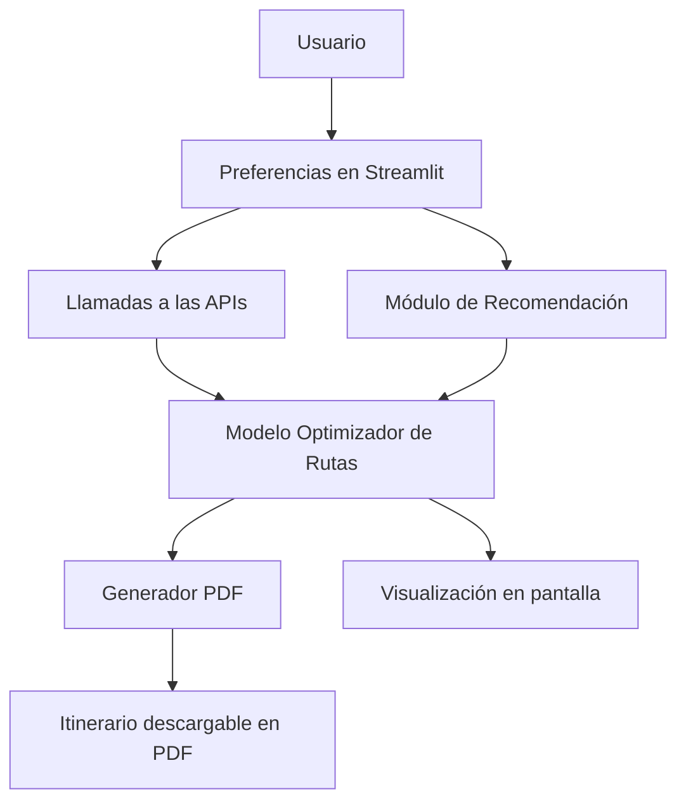

# 🗺️🍽️ Ruta Gastronómica Express

> _Itinerarios à la carte para paladares inquietos_

[](https://www.python.org/)
[](https://streamlit.io/)
[](https://opensource.org/licenses/MIT)

---

## 🌟 ¿Qué es esto?

**Ruta Gastronómica Express** es una aplicación web inteligente que te sugiere rutas personalizadas por los mejores restaurantes según tus gustos, tu presupuesto, el clima... ¡y tu hambre de aventuras!  
Todo esto en tiempo real y acompañado de un itinerario interactivo y un PDF con estilo.

---

## 🧠 ¿Cómo funciona?


---
## 🎯 Funcionalidades clave

- ✅ Recomendación de restaurantes basada en tus gustos  
- ✅ Rutas optimizadas según tiempo, transporte y clima  
- ✅ Mapa interactivo con itinerario  
- ✅ Generación de PDF personalizado con tu ruta  
- ✅ Modular, escalable y aplicable a otras ciudades  

---

## 🧪 Tecnologías

| Tipo             | Herramientas                                                  |
|------------------|---------------------------------------------------------------|
| Lenguaje         | Python                                                        |
| Backend Web      | Flask + Streamlit                                             |
| Recomendaciones  | scikit-learn                                                  |
| APIs             | Google Maps, TripAdvisor, OpenWeather, Valhalla               |
| Visualización    | Streamlit Map + PDF Generator                                 |
| Dev Tools        | GitHub, Postman, VS Code                                      |

---

## 🛠️ Instalación

```bash
git clone https://github.com/josemauma/TFM_Ruta_Gastronomica.git
cd TFM_Ruta_Gastronomica
pip install -r requirements.txt
streamlit run app.py
```

---

## 💡 Ejemplo de uso

1. El usuario accede a la interfaz y responde preguntas como:
   - Tipo de comida preferido
   - Presupuesto
   - Medio de transporte
   - Tiempo disponible
2. La app conecta con las APIs externas:
   - Google Maps
   - TripAdvisor
   - OpenWeather
3. Se genera una ruta optimizada con recomendaciones personalizadas
4. Se visualiza en un mapa interactivo
5. Se genera un PDF descargable con el itinerario y sugerencias

---

## 🚧 Estado del proyecto

- 🔍 En desarrollo   
- 🧠 Implementación de modelo de recomendación en proceso  
- 📄 Generación de PDF e integración de APIs próximamente  

---

## 📄 Licencia

Este proyecto está licenciado bajo la **Licencia MIT**.  
Consulta el archivo [`LICENSE`](./LICENSE) para más detalles.

---

## 📫 Contacto

**José Manuel Muelas de la Linde**  

Estudiante de Máster en Big Data, IA e Ingeniería de Datos  

📍 Málaga, España  
🔗 [LinkedIn](www.linkedin.com/in/josemanuel-muelas-delalinde)  
🐙 [GitHub](https://github.com/josemauma)

