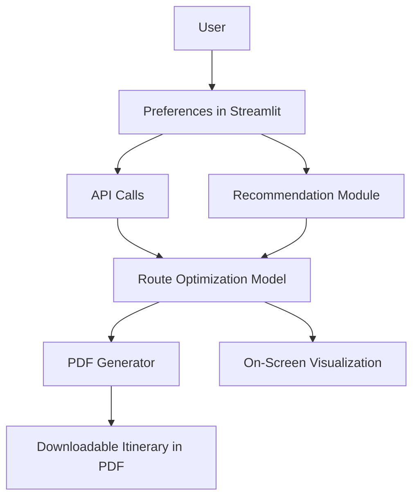

# 🗺️🍽️ Express Gastronomic Route

> _Itinerarios à la carte for adventurous foodies_

[](https://www.python.org/)
[](https://streamlit.io/)
[](https://creativecommons.org/licenses/by-nc-nd/4.0/)


---

---

## 🌟 What is this?

**Ruta Gastronómica Express** is a smart web app that suggests personalized routes through the best restaurants based on your tastes, budget, weather... and your hunger for adventure! 

All of this in real time, along with an interactive itinerary and a stylish PDF.

---

## 🧠 How does it work?


---
## 🎯 Key Features

- ✅ Restaurant recommendations based on your preferences

- ✅ Optimized routes based on time, transport, and weather

- ✅ Interactive map with itinerary

- ✅ Custom PDF generation with your route

- ✅ Modular, scalable, and applicable to other cities
  
---

## 🧪 Technologies

| Type             | Tools                                                          |
|------------------|----------------------------------------------------------------|
| Language         | Python                                                         |
| Web Backend      | Flask + Streamlit                                              |
| Recommendations  | scikit-learn                                                   |
| APIs             | Google Maps, TripAdvisor, OpenWeather, Valhalla                |
| Visualization    | Streamlit Map + PDF Generator                                  |
| Dev Tools        | GitHub, Postman, VS Code                                       |

---

## 🛠️ Installation

```bash
git clone https://github.com/josemauma/TFM_Ruta_Gastronomica.git
cd TFM_Ruta_Gastronomica
pip install -r requirements.txt
streamlit run app.py

```

---

## 💡 Example of Use

1. The user accesses the interface and answers questions like:
   - Preferred type of food  
   - Budget  
   - Mode of transport  
   - Available time  

2. The app connects to external APIs:
   - Google Maps  
   - TripAdvisor  
   - OpenWeather  

3. An optimized route with personalized recommendations is generated.  
4. It is displayed on an interactive map.  
5. A downloadable PDF with the itinerary and suggestions is generated.  

---

## 🚧 Project Status

- 🔍 In development  
- 🧠 Recommendation model implementation in progress  
- 📄 PDF generation and API integration coming soon  

---

## 📄 License

This project is licensed under the **CC BY-NC-ND 4.0 License**.  
See the [`LICENSE`](./LICENSE) file for more details.

---

## 📫 Contact

**José Manuel Muelas de la Linde**  
Master’s Student in Big Data, AI & Data Engineering


📍 Málaga, Spain  
🔗 [LinkedIn](www.linkedin.com/in/josemanuel-muelas-delalinde)  
🐙 [GitHub](https://github.com/josemauma)

